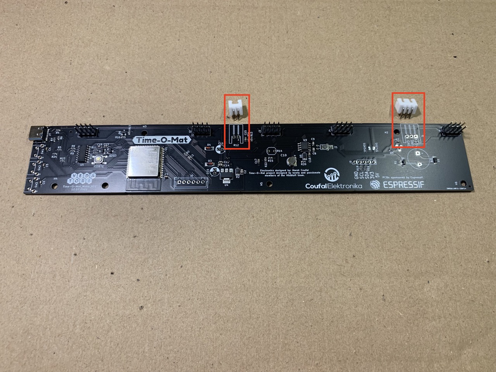
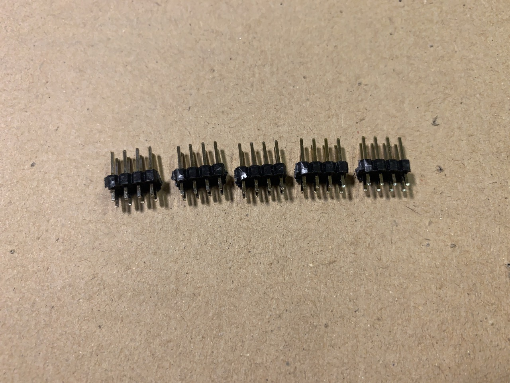
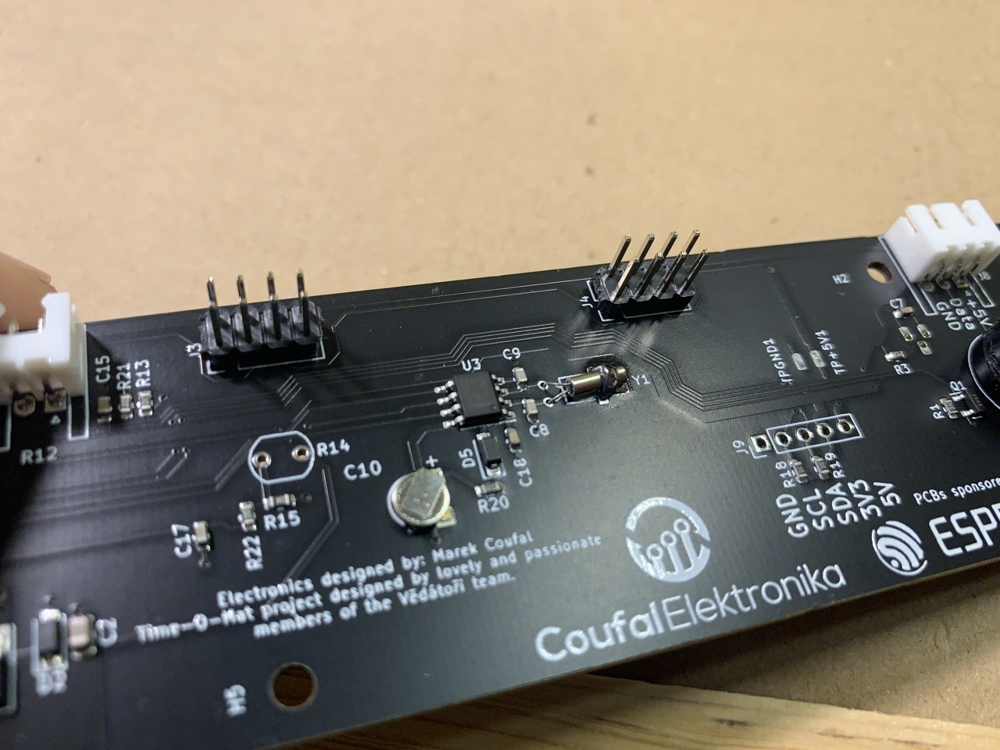

V tomto dokumentu je uveden návod na osazení desky plošných spojů elektronickými součástkami. Některé součástky byly osazeny strojově při výrobě desek. Zbytek osazení je předmětem tohoto návodu.
Pro tento návod si zavedeme následující pojmy:
* DPS (Deska Plošných Spojů) - Laminátová deska pokrytá elektricky vodivými měděnými cestami, na kterou budeme nyní pájet součástky.
* PCB (Printed Circuit Board) - To stejné, co DPS.
* SMD (Surface Mount Device) - Tzv. bezvývodové elektronické součástky, které mají krátké nožičky. Tyto součástky jsou připájeny k DPS pouze z jedné strany. Tyto součástky byly osazevy strojově při výrobě DPS.
* THT (Through-hole Technology) - Tzv. vývodové elekotronické součástky, které mají dlouhé nožičky. Tyto nožičky jsou před zapájením součástky prostrčeny skrz díry v DPS.

THT součástky budeme pájet následujícím způsobem:
1. Součástku vkládáme ze strany, kde je její obrys naznačen bílou čárou, tzv. silkscreenem.
1. Vývody (nožičky) součástek prostrčíme přisušnými otvory v DPS. Musí to jít lehce.
1. Součástku přitlačíme až k desce nebo co nejblíže.
1. Součástku pájíme ze strany, na kterou trčí její vývody. Tzn. z opačné strany, než je její bílý obrys na silkscreenu.
1. Vývody po zapájení zastřihneme.

# Obsah
* [Potřebné díly](#dily)
* [Potřebné nástroje](#nastroje)
* [Číslice - digity](#digity)
* [Hlavní PCB - horní strana](#hlavni_pcb_horni)
* [Hlavní PCB - spodní strana](#hlavni_pcb_spodni)

<!-- _________________________________________________________________ -->
## <a name = dily>Potřebné díly</a>

<!-- _________________________________________________________________ -->
## <a name = nastroje>Potřebné nástroje</a>

<!-- _________________________________________________________________ -->
## <a name = digity>Číslice - digity</a>

**Potřebujeme:**
* PCB s digity a dvojtečkou
* 5x female konektor 2x4 pinů do L
* 3D tištěný držák pro pájení konektorů
* štípací kleště
* pilník
* páječka

**Postup:**
1. Opatrně proti stolu od sebe odlámeme jednotlivé digity a dvojtečku.

1. Dáváme velký pozor, abychom lámali jen připravené můstky a nezlomili jsme samotnou dvojtečku.

1. Postupně rozlámeme všechny připravené můstky.

1. Pomocí štípacích kleští odštípeme všechny zbylé můstky.

1. Pomocí pilníků zabrousíme všechny zbytky po můstcích do roviny.

1. Připravíme si díly pro pájení konektoru na 1 digit.

1. Konektor zasuneme do 3D tištěného držáku.

1. Konektor s držákem nasadíme na digit.

1. Protější (levou) stranu digitu podložíme do roviny

1. Zapájíme všechny piny konektoru.

1. Zapájíme tímto způsobem konektory na všechny digity a dvojtečku.

<!-- _________________________________________________________________ -->
## <a name = hlavni_pcb_horni>Hlavní PCB - horní strana</a>

**Potřebujeme:**
* Hlavní PCB
* Konektorovou lištu s piny 2x20
* Konektor s 2 piny do L
* Konektor s 3 piny do L
* Konektor s 6 piny
* 2x kondenzátor
* fotorezistor
* krystal
* piezoakustický měnič
* 3x tlačítko
* 2x 3D tištěné držáky konektorů digitů
* 3D tištěný držák fotorezistoru
* štípací kleště
* páječka

**Postup:**
1. Nasadíme konektory do L s 2 a 3 piny na hlavní PCB.

1. Opatrně otočíme hlavní PCB a konektory zapájíme.

1. Nasadíme konektor s 6 piny na hlavní PCB.

1. Opatrně otočíme hlavní PCB a konektor zapájíme.

1. Nasadíme 3 tlačítka na hlavní PCB.

1. Zapájíme tlačítka na hlavní PCB.

1. Pomocí štípacích kleště nastříháme konektorovou lištu na 5 kusů o rozměrech 2x4 piny. Vzniknou konektory digitů.

1. Nasuneme konektory digitů do 3D tištěných držáků.

1. Nasadíme držáky s konektory digitů na hlavní PCB.

1. Držáky konektorů digitů namáčkneme co nejblíže na hlavní PCB.

1. Zapájíme všech 8 pinů každého konektoru digitu.

1. Tímto způsobem zapájíme všech 5 konektorů digitů. Pozor, aby byl hlavní PCB při pájení vždy v rovině.

1. Nasadíme oba kondenzátory na hlavní PCB. Dbáme na polaritu! Delší nožička patří do otvoru označeného plusem.

1. Kondenzátory zapájíme.

1. Pomocí štípacích kleští ustřihneme nožičky kondenzátorů co nejblíže hlavnímu PCB.

1. Nasadíme piezoakustický měnič na hlavní PCB. Dbáme na polaritu! Plus na měniči musí odpovídat plusu na PCB.

1. Měnič zapájíme.

1. Pomocí štípacích kleští ustřihneme nožičky měniče co nejblíže hlavnímu PCB.

1. Nasadíme krystal na hlavní PCB. Polarita je libovolná.

1. Krystal zapájímě. Dbáme na to, aby byl krystal při pájení opřený o stůl, tedy dělila ho od PCB mezera.

1. Krystal ohneme k PCB do pozice vyznačené na silkscreen.

1. Vybereme si jednu z ustřižených nožiček kondenzátorů z minulých kroků a v polovině ji ohneme.

1. Nožičku nasadíme do hlavní PCB do děr vedle krystalu.

1. Nožičku zapájíme ze spodní strany PCB.

1. Pomocí štípacích kleští ustřihneme zbytky nožičky co nejblíže PCB.

1. Zapájíme nožičku ke krystalu na horní straně PCB.

1. Vsuneme fotorezistor do držáku fotorezistoru.

1. Nasadíme držák s fotorezistorem na hlavní PCB. Na polaritě nezáleží.

1. Fotorezistor zapájíme.

1. Pomocí štípacích kleští ustřihneme zbytky nožiček co nejblíže PCB.

<!-- _________________________________________________________________ -->
## <a name = hlavni_pcb_spodni>Hlavní PCB - spodní strana</a>

**Potřebujeme:**
* Hlavní PCB
* Teploměr DS18B12
* Štípací kleště
* Páječku

**Postup:**
1. Nasadíme teploměr za *spodní* strany PCB až skoro nejblíže k PCB.

1. Teploměr zapájíme.

1. Pomocí štípacích kleští ustřiheneme zbytky nožiček co nejblíže k PCB.
