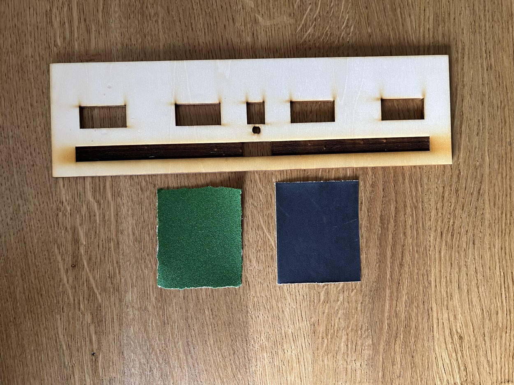
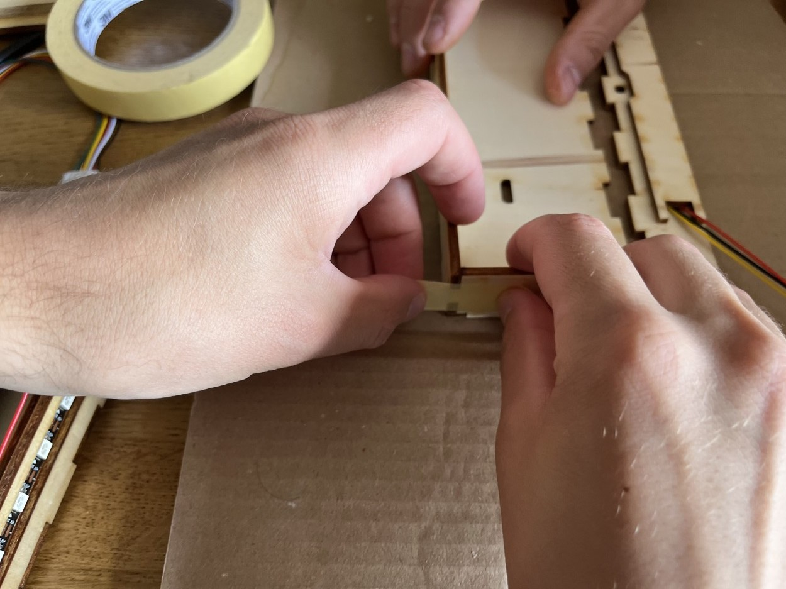
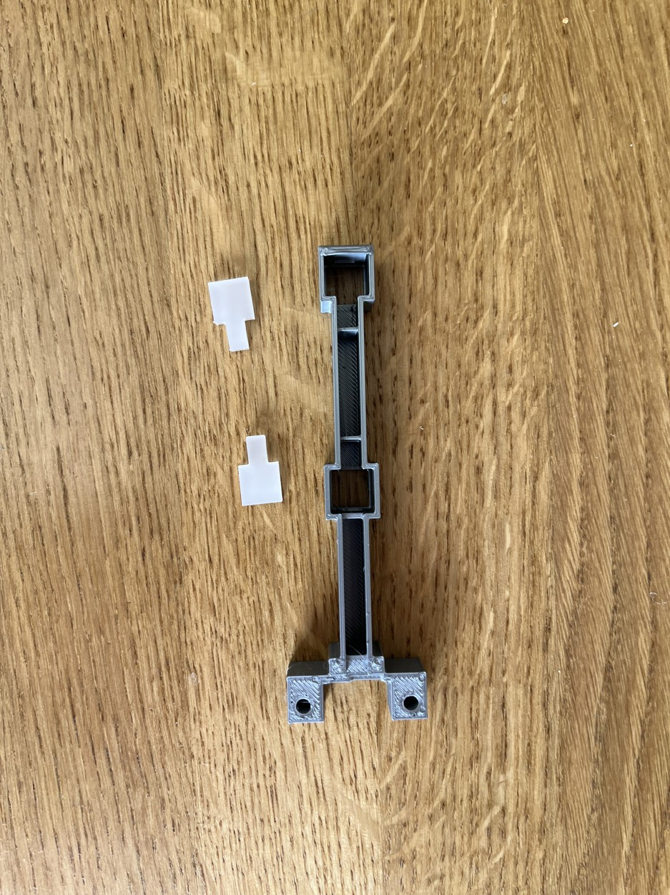
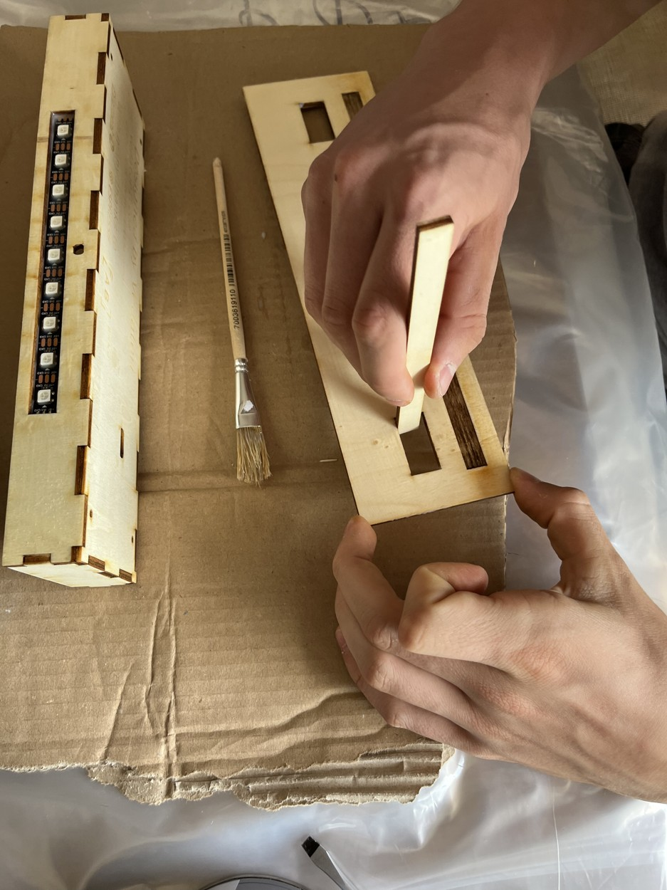
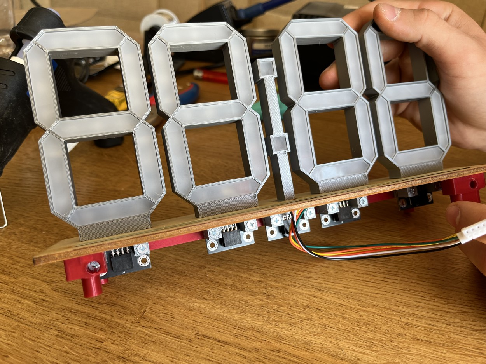
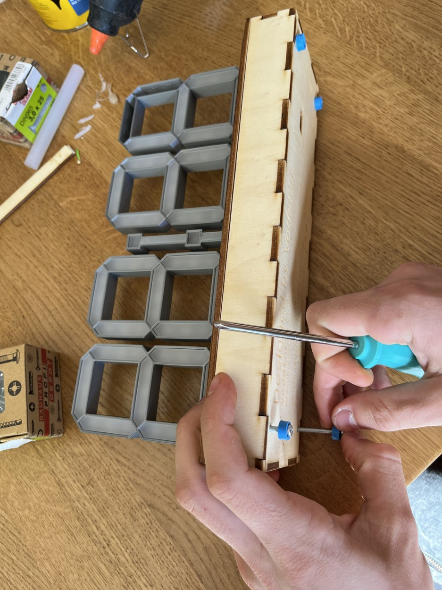

Tento dokument je návodem k sestavení mechanické části hodin Time-O-Mat. Hodiny jsou sestaveny z dílů vytištěných na 3D tiskárně, řezaných laserem (plexisklo a dřevo), spojovacího materiálu (šrouby a matky) a dalších doplňků.
Do postupu poprvé přidáváme lepení dílů, takže je potřeba tomu uzpůsobit styl práce. Pokud si před zalepením dílu nejste něčím jistí, je dobré si to buďto vyzkoušet ještě před nanesením lepidla a nebo zavolat vedoucího, který vám poradí. 

Používat budeme dvě lepidla
* **Herkules** - disperzní vodou ředitelné lepidlo na dřevo. Doba zasychání záleží na objemu naneseného lepidla, obecně platí, že pomocí tečkování aplikátorem ho naneseme takové množství, aby moc nebo vůbec nevytékalo z lepeného spoje po jeho zmáčnutí. Nanášíme pouze na jednu lepenou plochu a tečky můžeme poté špičkou lepidla rozetřít do plochy.
* **Chemoprén** - ten se nanáší pomocí párátka na obě plochy a roztírá se po ploše. I tady platí, že by lepidlo nemělo vytékat z lepeného spoje nadměrně ven. Po nanesení máte několik minut na spojení ploch, takže ani v tomto případě nemusíte extrémně spěchat. 

Při práci je důležité mít pořád čisté ruce a pracovní podložku, abyste si dřevo neumazali.
Další novinkou je lakování krabice. K tomu jsme vybrali polyurethanový lak, který je ředitelný vodou. Pro dobrý výsledek stačí nanést tenkou vrstvu laku tak, aby byla pokrytá celá lakovaná plocha (poznáte po naklonění plochy proti světlu). Nanáší se dvě vrstvy, to je v návodu popsáno.

___
# Obsah
* [Příprava překližkových dílů](#preklizka)
* [Vlepení LED pásku](#LEDpas)
* [Ochrana dotykové lišty](#lista)
* [Slepení krabičky](#krabice)
* [Vkládání difuzorů do segmentů](#osmicky)
* [Lakování krabičky](#lak)
* [Druhá vrstva laku](#lak2)
* [Vlepení lišty a fotorezistou](#vlepeni)
* [Finální sestavení](#final)
___

<!-- _________________________________________________________________ -->
# <a name = preklizka>Příprava překližkových dílů</a>

## Potřebujeme:
* všechny díly z překližky
* Hrubý smirek (zelený - 150)
* Jemný smirek (černý - 600)

## Postup:
Ukliďte si pracovní plochu po předchozích krocích, tj. odstraňte pájku, příslušenství k pájení a zbytky po něm.

Obruste hrubým (zeleným) smirkem tmavě gravírovaný prostor pro dotykovou lištu. Odbrušte tmavé gravírování v zahloubení. Zelený smirek nepoužívejte pro další broušení!

Výsledek po broušení tmavě gravírovaného prostoru musí vypadat jako na obrázku. Vyzkoušejte, že vám do něj zapadne dotyková lišta a že nikde nevyčnívá.

Jemným (černým) smirkem obruste pohledové plochy dřevěných dílů. Pohledové plochy jsou ty, kde je něco vygravírováno nebo ty, které jsou méně opálené od laseru.

Ukliďte si pracovní plochu po předchozích krocích, tj. setřete prach vzniklý broušením (nejlépe mokrou hadrou nebo kapesníkem).

<!-- _________________________________________________________________ -->
# <a name = LEDpas>Vlepení LED pásku</a>

## Potřebujeme: 
* zadní strana krabice
* podpůrný díl překližky pro LED pásek
* LED pásek s napájenými přívodními drátky
* Lepidlo Herkules
* Malý zalamovací nůž

 

## Postup:
Seřízněte hranu na vnitřní (nepohledové straně) zadního dílu překližky. Při pohledu na vnitřní stranu (zámky dolů) je to pravá hrana vnitřního otvoru. Zahlubte ji cca do hloubky 2 mm. 

Nalepte LED pásek na podpůrný díl. Musí být nalepený rovně, k tomu slouží vodící linky na dřevěném díle. Dávejte pozor, ať vývody směřují k výřezu na okraji.

BEZ LEPENÍ si sestavte spodní a zadní díl krabice, jak vidíte na obrázku. Do otvoru vložte 3D tištěný držák na fotorezistor, také ho NELEPTE.

Lepidlem Herkules nalepte překližku s LED páskem na zadní stěnu krabičky. Naneste malé množství lepidla tak, aby se nedostalo do prostoru uvnitř vodících čar. Je nutné díly slepit přesně tak, aby vodící čáry lícovaly s otvorem v zadní stěně překilžky. 

Slepené díly zatěžte a nechte uschnout.

<!-- _________________________________________________________________ -->
# <a name = lista>Ochrana dotykové lišty</a>

## Potřebujeme:
* Dotkyová lišta
* Papírová páska
* Malý zalamovací nůž

## Postup:
Nalepte pohledovou stranu (bez pájecích plošek) dotykové lišty na papírovou pásku.

Ořežte papírovou pásku přesně na rozměr lišty. Pásku nechte přilepenou, dokud v návodu nebude pokyn k jejímu sundání.

<!-- _________________________________________________________________ -->
# <a name = krabice>Slepení krabičky</a>

## Potřebujeme:
* Všechny díly krabice kromě víka
* Lepidlo Herkules
* Papírová páska

## Dobrá rada pro lepení:
Nanášejte vždy odpovídající množství lepidla. Pokud vám lepidlo po stlačení dílů vyteče na pohledové hraně, otřete ho papírovým ubrouskem směrem ven z krabice, nikdy ne dovnitř.

## Postup:
Slepte "ohrádku" ze zadní, přední, levé a pravé stěny krabičky. Zalepte první spoj, lepidlo naneste na všechny plochy, které se spojí. Slepený spoj poté stáhněte kusem pásky o délce cca 6 cm. Spodní překližkový díl zatím nelepte, ale použijte ho jako stojánek při lepení.

Stejně slepte i další rohy.

Před přilepením spodního dílu se ujistěte, že je správně otočený - je v něm výřez, který musí být blíž přední straně (bez LED pásku). Obdobným způsobem slepte "ohrádku" se spodním dílem. Papírovou páskou uchyťte všechny rohy a třemi pásy pásky délky cca 10 cm spojte krabičku tak, jak je vidět na obrázku. Při spojování dílů páskou vždy přidržte spojované díly tak, aby mezi nimi nebyla mezera.

<!-- _________________________________________________________________ -->
# <a name = osmicky>Vkládání difuzorů do segmentů</a>

## Potřebujeme:
* 4x 7-segment hodin (osmička)
* 28x Plexi segment hodin
* 1x dvojtečka
* 2x Plexi segment dvojtečky
* Kapesník / čistý hadr
* Inbus klíč vel. cca 3
* Jemný smirek (černý - 600)

## Postup:
Zkontrolujte všechny segmenty, jestli se na jejich hranách nenachází otřepy. Případné otřepy zbruste jemným smirkem. Stačí 1-2 tahy smirkem přes hranu.

Otřete kapesníkem všechny segmenty, které budete do osmiček a dvojtečky vkládat. 

Vsaďte segmenty do osmičky. Mají mírně lichoběžníkovitý tvar, do osmičky směřujte užší plochu segmentu. Jako první vsaďte spodní segment, poté postupujte směrem nahoru. Segmenty musíte vsazovat rovně, jinak se v tištěném díle vzpříčí. Pokud se to stane, nejjednoduší je segment vytáhnout a usadit znovu. Každý segment musí zapadnout do 3D tištěných západek.

Pokud je plast v okolí osmičky ohnutý, segment je nejspíš špatně usazený. Srovnejte ho, zkontrolujte, zda je zapadlý do zámků. Pokud je ohnutí jen mírné, je možné ho srovnat tak, že se 3D tištěný díl zmáčkne prsty.

Vsaďte plexi segmenty do dvojtečky. Tentokrát je vkládejte pod úhlem, jako první pod západku vložte širokou část. Tenkou část poté zatlačte inbus klíčem nebo podobnou širší koncovkou. 

<!-- _________________________________________________________________ -->
# <a name = lak>Lakování krabičky</a>

## Potřebujeme:
* Polyuretanový lak
* Slepená spodní část krabičky
* Víko krabičky
* Štětec
* Miska s vodou

## Postup:
Nalakujte pohledovou stranu víka (s gravírováním). Snažte se, aby lak nevniknul do otvorů v desce a do vygravírované prohlubně. Lak, který se do nich dostane, z nich odstraňte pomocí špejle, špachtle nebo párátka. Štětcem setřete přebytečný lak, který se usadil na hranách.

Sundejte ze spodní části krabice všechny pásky, které je držely při lepení. Natřete vnější plochy krabičky. Nechte ji uschnout tak, aby se natřené části nedotýkaly podložky (něčím krabičku podepřete). Štětcem setřete přebytečný lak, který se usadil na hranách. Lakem kompletně přetřete i LED pásek.

 

Štětec po dokončení lakování okamžitě ponořte do vody a vymyjte.

Ukliďte si pracovní plochu po předchozích krocích, tj. setřete prach vzniklý broušením (nejlépe mokrou hadrou nebo kapesníkem).

<!-- _________________________________________________________________ -->
# <a name = lak2>Druhá vrstva laku</a>

## Potřebujeme:
* Horní víko krabičky
* Spodní část krabičky
* Jemný smirkový papír (600 - černý)
* Polyuretanový lak
* Štětec, sklenice s vodou

## Postup:
Převědčte se, že první vrstva laku je vytvrzená. Poku ano, přebrušte lakované plochy. Většinou stačí méně než 10 tahů po každé ploše. Nebrušte LED pásek ani jeho okolí.

Přejeďte čistým prstem po vybroušeném povrchu a přesvědčte se, že je hladký.

Přebroušené povrchy nalakujte druhou vrstvou laku. Lak nechte vyschnout tak, aby se lakované části nedotýkaly podkladu (jako minule). Lak naneste znovu i k LED pásku.

Štětec po dokončení lakování okamžitě ponořte do vody a vymyjte.    

<!-- _________________________________________________________________ -->
# <a name = vlepeni>Vlepení lišty, fotorezistoru a spaceru</a>

## Potřebujeme:
* Fotorezistor napájený na přívodní kabel
* Dotyková lišta s napájeným kabelem
* Spacer pro desku plošných spojů
* Lepidlo Chemopren
* Libovolný šroub M3 a matka
* Párátko
* Šroubovák

## Postup:
Před slepením ověřte orientaci dotykové lišty, kabel musí směřovat k otvorům na osmičky. 

Vlepte dotykovou lištu do vygravírované prohlubně. Naneste lepidlo na obě lepené plochy. Lepidlo nanášejte pomocí párátka a rozetřete. Zatěžte.    

Vlepte fotorezistor s jeho držákem. Lepidlo naneste na zadní a spodní plochu držáku i dřeva. Přimáčkněte nejlépe svorkou.

Nalepte spacer do krabice. Musí být umístěn v blízkosti děr v boční ploše. Po nalepení ho stáhněte šroubem a matkou.

Tavnou pistolí zafixujte vývody dotykové lišty.

<!-- _________________________________________________________________ -->
# <a name = final>Finální sestavení</a>

## Potřebujeme:
* 4x osmička
* Dvojtečka
* Distanční vložky pro osmičky a dvojtečku
* 10x M3x25
* 1x M3x20
* 4x M3x30
* 15x M3 matka
* Nalakovaná krabice
* Obě části 3D tištěného nosníku
* Stojné nožky

## Postup:
Do horních otvorů na matky v nosnících vložte 5 matek. V případě potřeby je zatlačte o tvrdou podložku. Pokdu volně vypadávají, můžete je přichytit trochou lepidla.

Vložte desku plošných spojů do plastové osmičky. Stejně tak i do dvojtečky.

 

Plastovou osmičku vsuňte do první pozice včetně plastového distančního dílu. 

Do otvoru u kraje desky zasuňte předem šroub M3x25 se zápustnou hlavou.

Nosník vložte k první plastové osmičce. Do otvoru vložte matku a do ní zašroubujte první šroub. Nedotahujte.

Stejný postup zopakujte s druhou částí nosníku a osmičkou na poslední pozici.

Vložte ostatní osmičky a dvojtečku, jejich desky plošných spojů a distanční díly, přidejte k nim matky a zašroubujte. Pořád neutahujte.

Až jsou vložené všechny části, postupně šrouby utáhněte.
 

Zapojte konektor dotykové lišty na hlavní desku.

Spojte hlavní desku s osmičkami a dvojtečkou.
 

Zapojte fotorezistor a LED pásek.

Připevněte hlavní desku šroubem M3x20.

Vsuňte horní část sestavy do spodní, zasuňte na doraz. Pozor na kabely, neskřípněte je.

Na šrouby M3x30 nasuňte nožky. Šrouby s nožkami zašroubujte skrz otvory ve spodní části krabice.

Až bude mechanika kompletní, sundejte ochrannou pásku z dotykové lišty.
