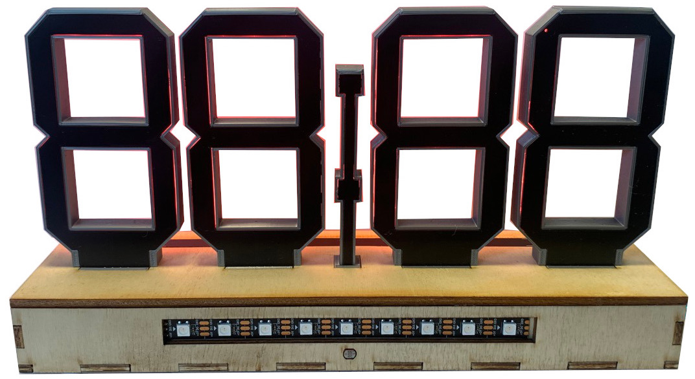

# Time-O-Mat [cz]
Time-O-Mat jsou hodiny navržené pro Letní robotický tábor 2022 organizovaný spolkem [Vědátoři](vedatori.com). Jedná se o otevřenou platformu, která si klade za cíle zlepšit dovednosti při mechanické stavbě a pájení. Účastníci dostali tento výrobek jako stavebnici, kdy z předem připravených dílů sestavili mechanickou část a poté pájeli nestandardní součástky na DPS s předem osazenými SMD součástkami. Po finalizaci je možné hodiny naprogramovat a používat pro zlepšení schopností algoritmizace a programování účastníků díky možnostem, které poskytují vsupní a výstupní periferie.

Mechanickou část lze rozdělit na dvě hlavní části - krabici a osmičky (segmentové zobrazovače). Vnější části krabice jsou vyřezány z překližky na laserové řezačce a obsahují zámkové západky. Ty se při stavbě lepí disperzním lepidlem a po vyschnutí tvoří pevný základ pro uložení ostatních dílů. Pouze horní část je odnímatelná a připevněná šrouby, které jsou schované v podpůrných 3D tištěných dílech, aby nekazily estetický dojem. Základní díl osmiček a dvojtečky je vytisknutý na 3D tiskárně a difuzery jednotlivých segmentů vyřezané z mléčného plexiskla se do něj vkládají z vnitřní strany a jsou uchyceny pomocí západek. Spojení osmiček a krabice zajišťuje 3D tištěný nosník umístěný uvnitř krabice, který také fixuje desky plošných spojů (DPS).

Hlavní DPS obsahuje zejména mikrokontroler ESP32, který je na ni připájen. Programování a napájení je zajištěno přes USB C. Hlavní DPS obsahuje také tlačítka, fotorezistory, bzučák a teplotní senzor. Do horního krytu je vsazena tenká podlouhlá DPS, která slouží jako senzor s osmi kapacitními tlačítky. Dominantou tohoto zařízení jsou DPS ve tvaru osmiček a dvojtečky, které jsou vsazeny za difuzery. Za každým segmentem jsou umístěny tři adresovatelné RGB LED. Další takové LED jsou umístěny zezadu na LED pásku, který zajišťuje ambientní podsvětlení prostoru za výrobkem. Hodiny jsou rozebiratelné, jednotlivé DPS jsou spojeny konektory, vzdálenější periferie pomocí kabelů.

Všechny periferie byly zvoleny tak, aby vytvořily hodiny s mnoha volitelnými postranními funkcionalitami. Díky nim je možné u účastníků tábora rozvíjet jejich schopnost algoritmizovat úlohu a programovat. Pro hodiny byla naprogramována softwarová knihovna, která výrazně zjednodušuje ovládání všech periferií. Pomocí této knihovny byl vytvořen vzorový software, který zobrazuje základní čas po připojení hodin na Wi-Fi. Po odpojení je poté čas uchován pomocí integrovaného RTC modulu, což umožňuje provoz hodin bez trvalého připojení k internetu. Hodiny je možné ovládat pomocí vstupních periferií nebo přes WiFi skrz počítač nebo smartphone, které přistupojí k interně hostované webové stránce. Všechny tyto vlastnosti lze přeprogramovat a přidat nové funkcionality podle přání vlastníka hodin. Zařízení se programuje ve Visual studio Code v jazyce c++ pomocí frameworku esp32-arduino.

Myšlenkou tohoto projektu je, aby Time-O-Mat tvořil každodenní užitečný doplněk pokoje, ale aby mohl být jeho software jednoduše modifikován a rozvíjen tak, jak si každý jeho vlastník představuje.

# Time-O-Mat [en]
Time-O-Mat is a clock designed for Summer robotics camp 2022 (cz) organized by Vědátoři team (cz). It is a robotic platform offering development of mechanical assembly and soldering skills. The project has been designed as a kit for participants to be assembled and special electronic components to be soldered on a pre-assembled printed circuit board (PCB). When assembled it can be used to improve algorithmization and programming skills.

Mechanical set consists of two main parts - box and eights (segment displays). Box is made of laser cut plywood parts with latches that are mostly glued together. Upper parts are fastened using bolts hidden in inner 3D printed parts. The eights are 3D printed bodies with diffusers made of plexiglass clicked in them. Inner 3D printed parts ensure connection of the box and the eights.

Main PCB carries ESP32. It is programmed and powered using USB C and contains buttons, buzzer and photosensors. Capacitive touchbar with eight touch buttons is placed on upper part of the enclosure. Main eye-catcher of the clock is eight-shaped PCB with segments containing three adressable RGB LEDs in each segment. Ambient backlight is provided by LED strip on the backside of the clock. Clock can be disassembled if needed for upgrade or service and connectors are used for PCB interconnections.

All of the peripherals had been chosen to enrich the clock with various related functions. This enables development of algorithmization and programming skills of camp participants. Special internally developed software library makes programming of the clock much easier and allows better understanding of software features. Repository contains demo project that allows WiFi connection and time alignment of the clock with the Internet. Time is stored in RTC module after power off and it is not needed to establish WiFi connection after next power on. Clock can be controlled using input peripherals and Wi-Fi (using smartphone or PC) thru internally hosted website.

New features based on owner's needs can be easily introduced. Main aim of Time-O-Mat is to be a daily companion that offers easy software modifications and development.

Při stavbě hodin Time-O-Mat postupujte podle připravených návodů v následujícím pořadí:
1. [Návod pro elektroniku](https://github.com/vedatori/Time-O-Mat/blob/main/Manuals/Time-O-Mat_electronics_cz.md)
1. [Návod pro mechaniku](https://github.com/vedatori/Time-O-Mat/blob/main/Manuals/Time-O-Mat_mechanics_cz.md)
1. [Návod pro programování](https://github.com/vedatori/Time-O-Mat/blob/main/Manuals/Time-O-Mat_programming_cz.md)

## Licence
* Obsah tohoto repozitáře mimo složku *Software* je sdílen pod licencí [Attribution-NonCommercial-ShareAlike 4.0 International (CC BY-NC-SA 4.0)](https://creativecommons.org/licenses/by-nc-sa/4.0/).
* Obsah složky *Software* je sdílen pod licencí [GNU Lesser General Public License v3.0](https://www.gnu.org/licenses/lgpl-3.0.en.html).

## License
* The contents of this repository excluding folder *Software* is shared under license [Attribution-NonCommercial-ShareAlike 4.0 International (CC BY-NC-SA 4.0)](https://creativecommons.org/licenses/by-nc-sa/4.0/).
* The contents of the folder *Software* is shared under license [GNU Lesser General Public License v3.0](https://www.gnu.org/licenses/lgpl-3.0.en.html).

# Time-O-Mat

